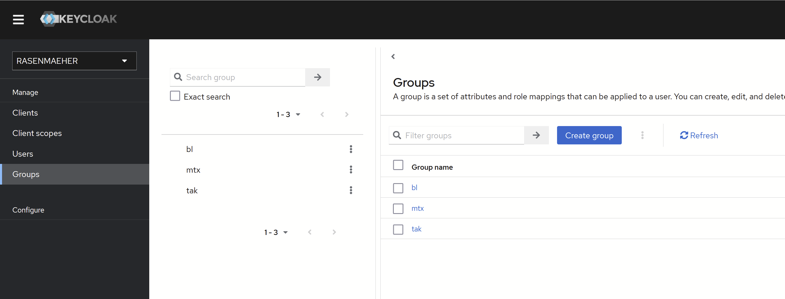
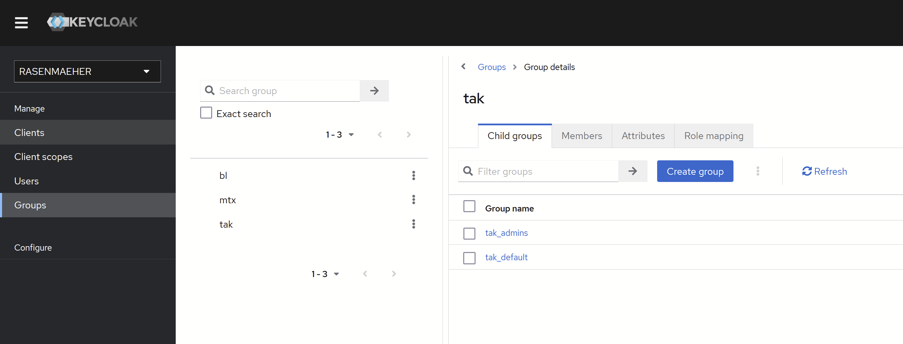
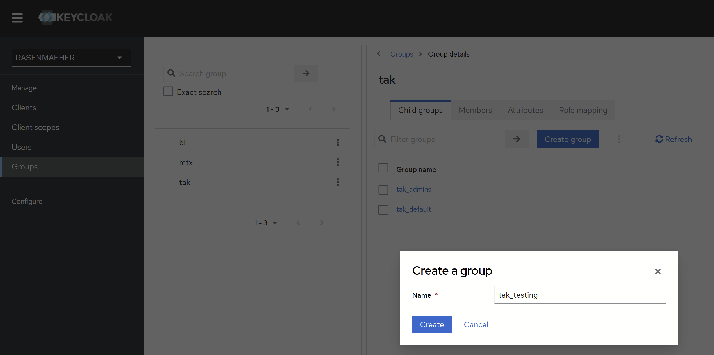
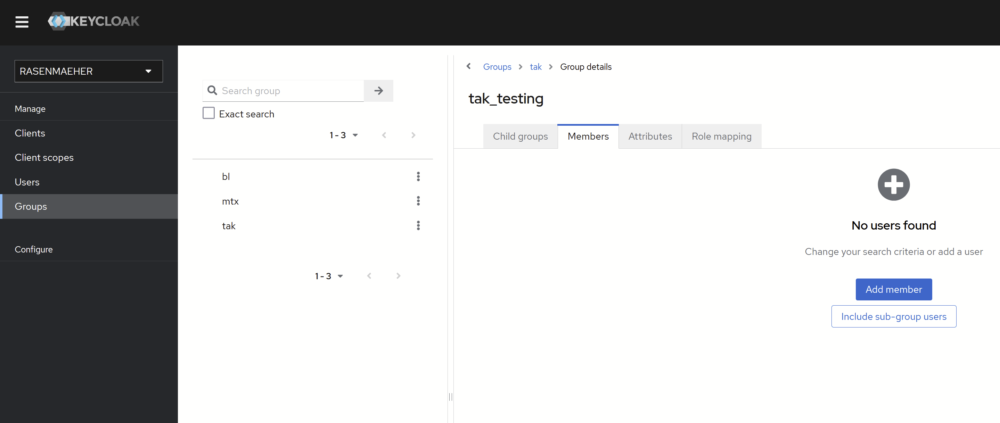
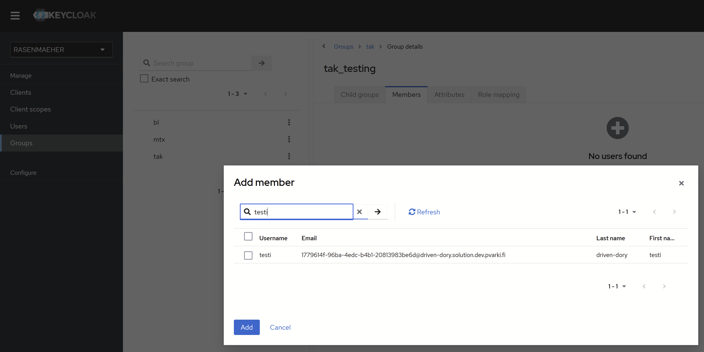
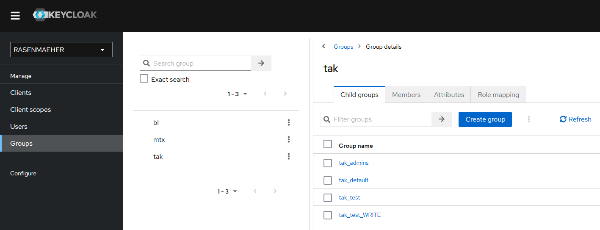

Current Rasenmaeher environment uses Keycloak to manage user groups. These groups are relayed to takserver and connected users get them automatically.

The idea in long term is to get the group management to Rasenmaeher in some capacity.

## Basic instructions:

* Login to keycloak with kc.your-server.fi using the mtls certificate provided with Rasenmaeher.
* Navigate to Groups on the sidebar
* Navigate to tak Group to manage TAK Groups.
* Create a group in the Child groups page of tak Group
  * Naming has to be tak_groupname
* Navigate to the new Group
* Navigate to Members and Add member
  * Choose users you want to add to the Group

Users in the new Group that are connected to takserver will get the new Group

\n 

 

 

 

 

## Advanced instructions: (Write or Read Groups)

Create Groups the same way as Basic instructions, but in the Group naming use _WRITE or _READ to specify how the users in the group are dealt with.

tak_test_WRITE group users are sending information to test group but cannot receive information from it.\n\nThis feature can be used to let Command Post see everyone but only permitted users get the full access or read access to CP group. (tak_CP for Command Post personnel)

 
