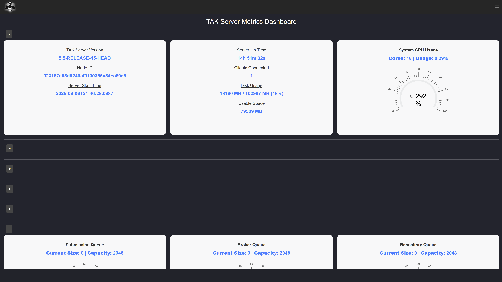
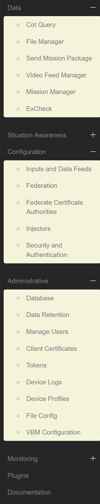

Takserver UI is found at tak.server.fi address on Rasenmaeher environment.

 

The dropdown menu on the right side is where the functions can found and the official tak.gov documentatio  is at the end "Documentation".

 

\

\
