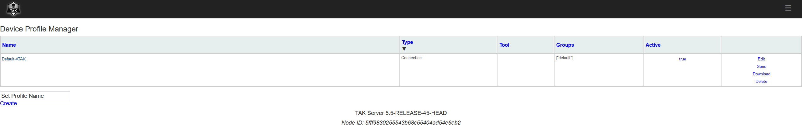
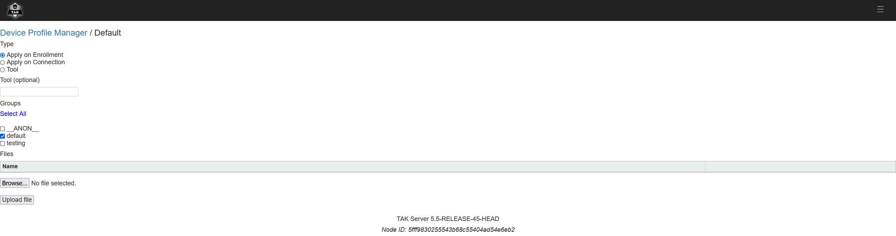

Device Profiles are used to manage devices connected to takserver. Mainly ATAK as the device needs to support receiving profiles from the server.

Device Profiles are made in the Device Profile Manager and are implemented on users in specified groups. The profiles can be shared to users with enrollment, connection to server or as a manual tool.

The preferred format of shared settings is .pref files inside a TAK data package, as the packages can trigger import function in ATAK for the files inside the data package.

  

#### Apply on Enrollment

With username/password enrollment for certificate users can get settings for the EUD's. This is mainly used as first/minimum configuration for users in the server like update server, maps and toolbars for users.

#### Apply on Connection

User already enrolled or with connection via certificate can be have their configurations updated when they reconnect to takserver when needed. This can be used to provide needed changes or provide additional setting for additional features. Like Medic toolbar for users in Medic group or update the Mesh encryption key's when they are updated. 

#### Tool

Tool is used as a manual method of updating configurations or sharing files to specified users. Mainly as a forced update for users that haven't gotten the files with other methods.
