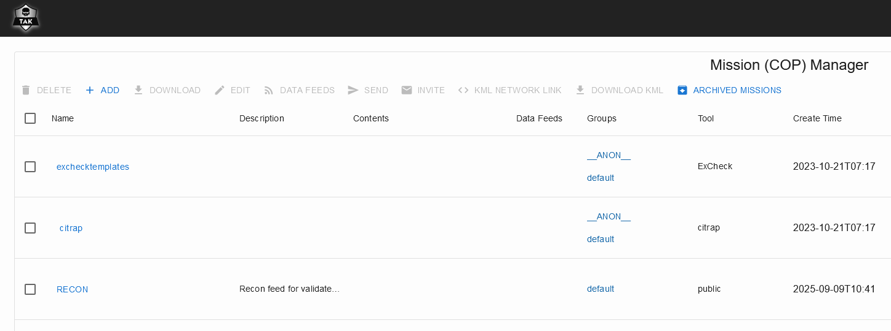
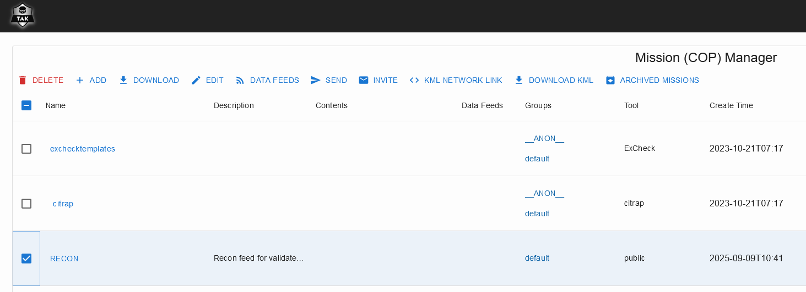
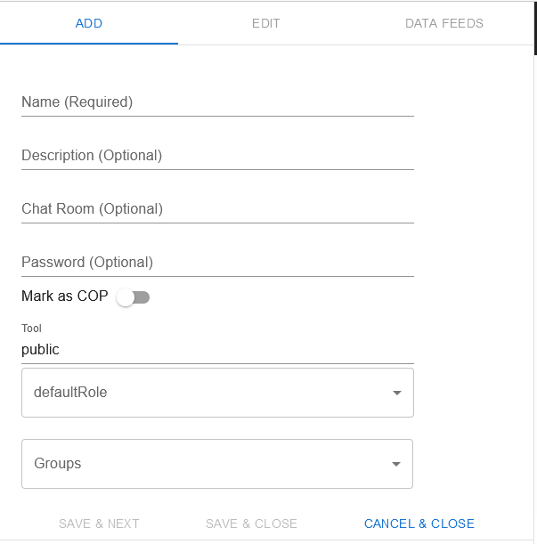
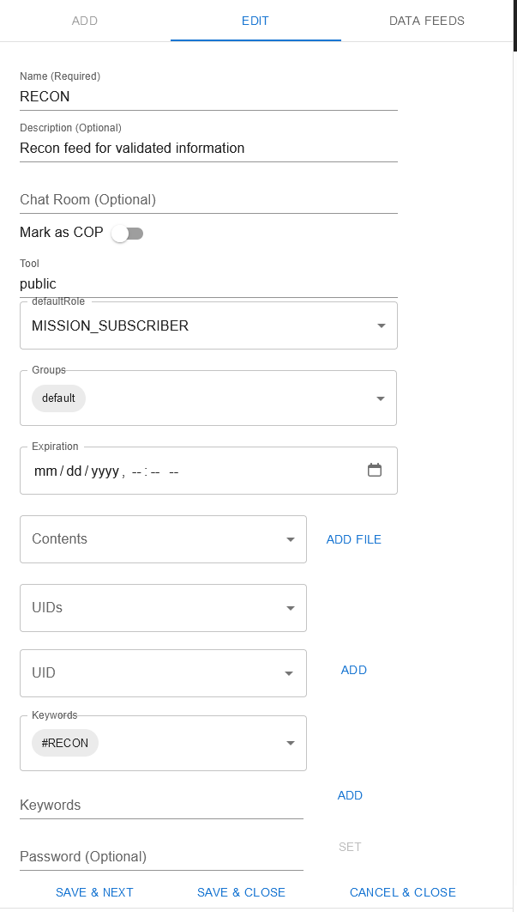
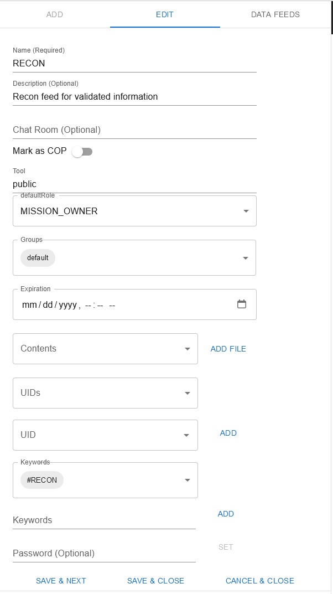
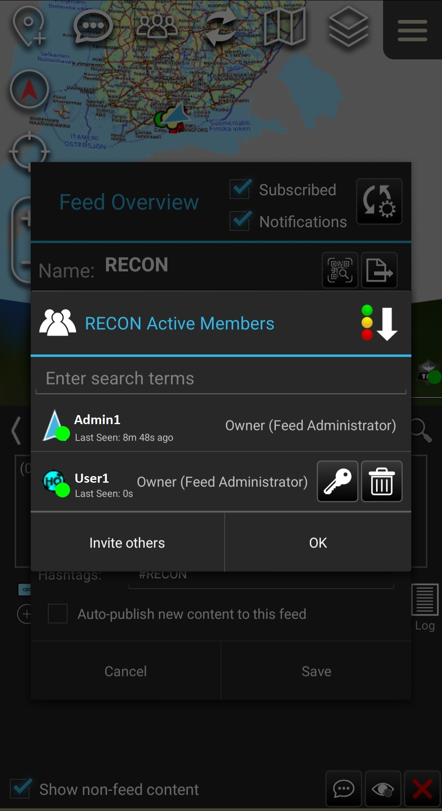

Missions (Data Sync Feeds) are managed withing Mission Manager inside takserver UI.

Mission Manager can be found  at https://tak.server.fi:8443/Marti/MissionManager.html

 

## Managing Missions

Managing the Missions (Data Sync - Feeds) is done withing Takserver or with TAK Products in Data Sync tool. For Managing the Missions the user need either Owner or Write user rights for the feed. If you want to change your user rights check [Change User Rights](https://pvarki.getoutline.com/doc/mission-manager-data-sync-HdRqCuoE2v#h-change-user-rights).

 

### Create Mission

Admin users can create missions in the Takserver Mission Manager. Choose + ADD and fill the in what is wanted for the feed. If the defaultRole is set as ReadOnly, you will need to set Owner and/or ReadWrite users. For this check [Change User Rights](https://pvarki.getoutline.com/doc/mission-manager-data-sync-HdRqCuoE2v#h-change-user-rights).

The main things to set for the Mission are the Name, possible Password, defaultRole and Groups. \nThe defaultRole sets the user rights for users that are subscribing to the feed: ReadOnly, ReadWrite, Owner..\nGroups setting defines what takserver groups will see the feed and can subscribe to it.

 

### Delete Mission / Archive

Deleting Missions is done with selecting the feeds and choosing Delete. The deleted feeds are kept in the Archived Missions so the data hasn't been removed from the server.

 

### Edit Mission

Editing mission via takserver is done from the Mission Manager, choose the feeds that are desired to change and change the settings. Select Save and Close after the changes are done.

 

### Change User Rights

If the RECON feed is needed to be ReadOnly for basic users, at least one of the admins needs to be set as Owner for the feed so they can manage it.

To get user to be the Owner from takserver the feed needs to be edited to use the defaultRole of Owner and the wanted user needs to subscribe to the feed to get the rights. After all the needed users have the needed Role the setting can be changed back to what is needed for the other users.

Owners can change other users Roles withing the data sync -plugin and manage the users by inviting them or removing them from the feed. Changing the role is done within the feed settings in the Active Members menu via the key-icon.

  
