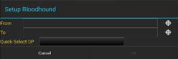
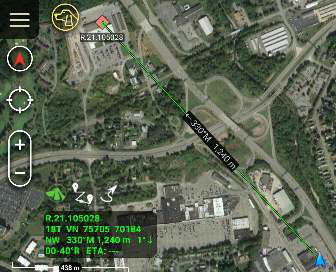
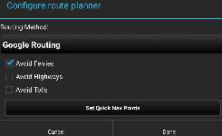
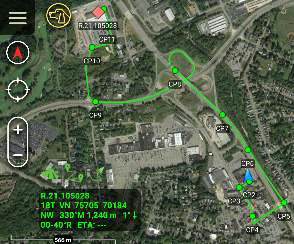
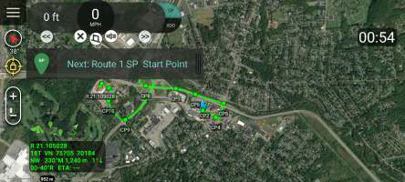
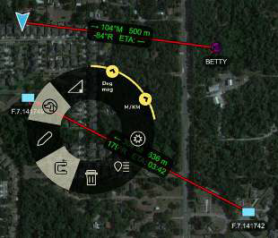

The Bloodhound Tool provides support for tracking and intercepting a map item. It allows for the selection of two points on the map, and/or map objects, and displays Range & Bearing information between the chosen tracker and the target.

## Basic use

 Select the Bloodhound icon to open the Bloodhound Tool. A prompt will appear to choose where to start by tapping the From Reticle (default = local device's Self-Marker) and where to  bloodhound (track) to by tapping the To Reticle. Use Quick Select DP to quickly select a DP to bloodhound to instead of using the To Reticle.

Targets include map objects like other user's Self-Markers, DPs, CoT Markers, Shape center points, Range & Bearing endpoints, etc. If a map location is selected instead of an object as the target, Bloodhound will place a waypoint marker there. The Self-Marker will then track towards the waypoint.

Select OK and Bloodhound will be activated.

 If either point moves, the green widget in the lower left will show the updated information. As the tracking object begins to navigate toward the target, the Estimated Time of Arrival (ETA) will update accordingly.

The green line showing the direct path from the tracker to the target will flash when a user-defined ETA outer threshold is reached (default = 6 minutes from target). The line will flash as the tracker continues toward the target until the next ETA threshold is reached (default = 3 minutes). The line will turn a flashing yellow until the final ETA threshold (default = 1 minute) is reached. The line then flashes red until the target is reached. 

Colors and thresholds can be modified in Settings > Tool Preferences > Specific Tool Preferences > Bloodhound Preferences.

## Route Mode

 Select the Route Mode icon in the bottom left corner of the screen when the bloodhound tool is active to activate Route mode. The Route Mode feature requires that a route planner (e.g., the planner that is bundled with the [VNS -plugin](https://pvarki.getoutline.com/doc/vns-plugin-6eZoNDPEBA)) has been installed and configured.

 Once the route planner has been configured, the Bloodhound's Range & Bearing line will

become a route. This will update periodically (the default is 1 second) to determine if the

route from the start map item to the end map item needs to be calculated. This occurs when

either the start or the end map item is a pre-configured distance away from the calculated

route (the default is 150 meters). This setting can be changed in the Bloodhound preferences.

 

## Navigation Mode with Route Mode

 When Route Mode is active, the Navigation Interface can be activated by selecting the Open

Navigation Interface icon. The navigation interface provides voice and visual cues like those

that are used when navigating traditional routes.

 

## Multiple Bloodhounds

To create multiple bloodhounds, open Range Tools, select the R&B Line icon, then select any two markers on the map. Once the R&B line is created between the two map items, select the line to open the radial, then select the Bloodhound icon from the radial. The bloodhound information will be displayed on the R&B Line.

 

If either point moves, the Bloodhound information shown on the R&B Line will update. As the tracking object begins to navigate toward the target, the Estimated Time of Arrival (ETA) will update accordingly.
