# Short instructions

## Contacts

 

## GeoChat - Group Management

  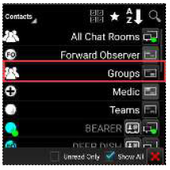

## GeoChat - Messaging

 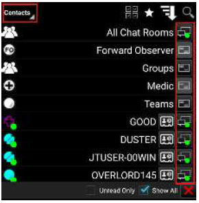

## Chat

  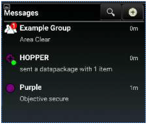

# Full Contacts / GeoChat / Chat manual instructions

## Contacts

 The Contacts list includes a variety of ways in which a user may communicate with other users on the local network or TAK Server. A default communication type (shown in the last column) may be selected and used until another type of communication is selected.

 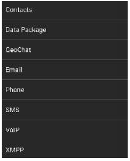There are several ways within the Contact Tool to filter the contact list. To only see contacts that use a specific communication type, select the arrow next to the word "Contacts" at the top of the list window. A window will open showing all the types of communication, such as Data Packages, GeoChat (built-in chat capability), Email, Phone, SMS, VoIP and XMPP. Choose one of these to ensure all contacts without that type available are filtered out of the contacts list. 

Note: If the type chosen is not the default for a user, the type can be accessed through their radial. 

 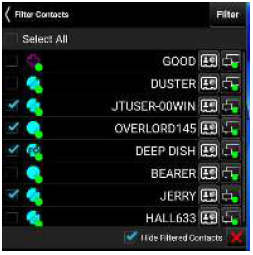Options located at the top right of the contact's window, available for all communication types, include Multi- Select, Favorites, Sorting and Searching. The multi-select option provides the ability to filter out contacts. Any number of contacts can be filtered. Filtered contacts will be removed from the map and can be removed from the map and can be removed from the Contact's window, if Hide Filtered Contacts is enabled.

 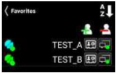Contact's window, if Hide Filtered Contacts is enabled. To add a contact to Favorites, select the Star icon, select the + icon, choose the contact(s) and then select Add.

 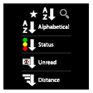Select the Sort icon to sort contacts alphabetically, by connection status, by unread messages or by distance from the Self-Marker. The sort type will change with each tap of the icon. 

 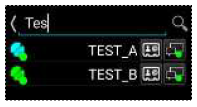Select the Search icon to search for a specific contact. As the search criteria is entered, any contacts that meet the criteria will begin to appear.

 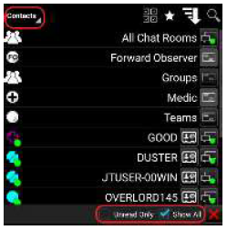The Contacts list also has two filters available at the bottom of the screen. The Unread Only box, when checked, will display only contacts with whom an unread message is waiting. When unchecked (default), all available contacts are displayed. The Show All box, when checked (default), will display all contacts regardless of their location. When unchecked, only contacts that are visible within the current map view will be displayed.

 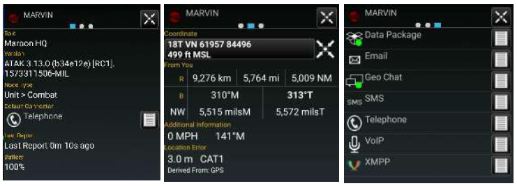Profile cards (accessed by selecting the second to last column) are available for each contact and contain additional information about that contact including: 1) Role, software type and version installed, node type, default connector, last reported time, battery life, 2) Location information and 3) Available types of communication.

## GeoChat Group Management

  GeoChat Group Management is initiated through Contacts. Select the Contacts icon, then select the Groups line (not the communications button). The local device can create, edit and delete chat groups, as well as sub-groups. To create a chat group, select the Add Group icon, enter a group name, select the contacts to add to the group and select Create. 

 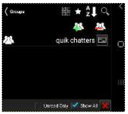If a parent group is being created, no contacts need to be added at this level. To add a nested group, select the parent group, select the Add Group icon, enter a group name for the sub-group, choose the contacts that will be in the group, and select Create. Groups may be managed using the add/delete contacts or add/delete GeoChat groups options.

 To add users to an existing group, select the Groups line (not the communications button), then select the name of the group. Select the Add Users icon. A window will open allowing the group creator to add users to the selected group. Select the Add button when all the users to be added are checked.

 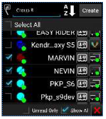

## GeoChat Messaging

If the user specifies the GeoChat (built-in Chat capability) communication from the drop-down at the upper left, group and person-to-person messaging is filtered. In addition to the toolbar options that are available with other communication types: Favorites, Sorting and Searching, the GeoChat communication type also has a History option (Clock icon). If the History option is selected, chat history with the selected contact is displayed. 

 To view messages from or send messages to an individual, select the desired contact's Communication icon.

Select All Chat Rooms to view all messages from or send messages to all present on the network and TAK Server. Other groups available for viewing or sending messages are: Forward Observer, Groups (user made), HQ, K9, Medic, RTO, Sniper, Team Lead, and Teams. If the user's current role is Forward Observer, HQ, K9, Medic, RTO, Sniper or Team Lead, that user can view or send messages to all other contacts with the same role.

If a GeoChat message is sent from the top level of Teams, it will be sent to all contacts, similar to All Chat Rooms.

When a sub-team is chosen, messages can only be sent to the user's active (my team) team color. When a parent group is chosen, messages are sent to all members of the parent group, as well as all of the sub-groups. When a sub-group is chosen, messages are sent only to members of the sub-group. Individuals or groups listed within GeoChat may be removed from the contacts menu by toggling off their visibility in Overlay Manager.

 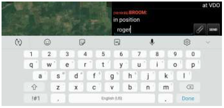

Selecting in the Free Text Entry area will bring up an onscreen keyboard.

Selecting Add Attachment will display selection options for choosing items to send. The selection options presented are identical to those seen when creating a Data Package. Map items may be selected by using Map Select or Lasso.

 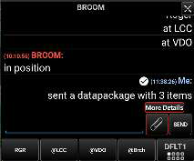

Select Overlays to choose from previously imported files or map items listed in the Overlay Manager. Files on the device's internal storage or SD card can be selected using File Select. After the attachment(s) have been selected, an entry will be generated in the chat indicating that a data package has been sent. Select More Details to see a breakdown of the sent attachments. 

 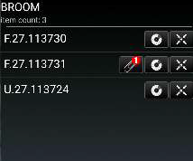The items sent can be seen listed in the breakdown. In addition to the name of the item, options exist to View Attachments associated with a map item, Display the Radial of the map item, and Pan To the map item.

 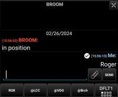 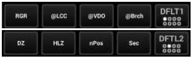At the bottom of the chat area are pre-defined messages that may be used to quickly create a message to send. Select the current menu button to scroll through the eight different menus of pre-defined messages, including: DFLT1, DFLT2, ASLT1, ASLT2, JM1, JM2, RECON1 and RECON2. These predefined messages  present an easy way to transmit a brief message to other network members concerning position or other important communication. The messages may be changed by long pressing on the button and changing its label and corresponding text.

 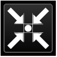Selecting the Pan To icon, located at the top right of the call sign in an individual chat, will pan the map interface to that user's location.

 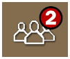 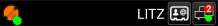A numbered red dot will appear on the Contacts icon when a message has been received successfully. The number denotes the number of unread messages that have been received. Select this icon to view the contact list. The username who sent the message will appear with a numbered red dot next to their name. Alternatively, the text of the message can be read by dragging down from the top to open the Android notifications drawer. This notification will only remain available for a short time.

 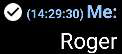 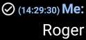When sending a chat message to a user, a "read" indicator will appear next to the sent message. When the indicator is filled (white background, dark checkmark), it indicates the recipient has read the message. 

When the indicator is an unfilled (dark background, white checkmark), it indicates the message has been delivered but the recipient has not opened their chat window to view it.

Newer TAK Servers can hold messages sent to disconnected users and deliver the messages the next time the offline user reconnects to the server.

## Chat

 The Chat tool logs, organizes and displays the most recent chat message that was sent from each chatroom associated with the local device. This provides a quick resource to see the most current chat activity for all subscribed groups and conversations.

 Each entry in the Chat tool will display who the message exchange is with, what the last message said and when the last message was sent. The list of entries is ordered by timestamp with the most recent appearing at the top. 

Selecting a group or conversation will immediately open the GeoChat feature in Contacts for additional interaction. Select a chat message entry to open the chatroom associated with the message. Select Search to input text to search for a specific message or sender. Select + to open the Contacts tool. Messages that haven't been read yet will display a red indicator, like the Contacts tool.
