Locations of interest can be entered using the Point Dropper tool. Select the Point Dropper icon to place internationally standardized markers and other icons on the map, edit the data and share the markers with other network members.

## Basic use

 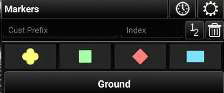Select the Point Dropper icon to open the Point Dropper menu, which contains several iconsets, recently added points and an Iconset Manager. The basic Markers symbology affiliations are: Unknown, Neutral, Red and Friendly. Select a marker from the pallet, then tap a location on the map to drop the marker.

 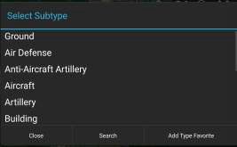To apply a particular subtype to a marker, tap on the subtype field to reveal the list of available subtypes. Make a selection from the list or use the Search option to search for a particular subtype. To place a marker using manually entered coordinates, choose the marker type and long-press a location on the map. A window will open allowing for the entry of the desired coordinates (MGRS, Lat./Long, etc.).

To change the standard naming convention when placing markers, enter values into the custom prefix and index fields. If values are entered, the next marker will be dropped with the prefix name and starting number(s) or letter(s) and every subsequent marker will be assigned the next consecutive number(s) or letter(s).

## Mission markers

 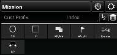Select the mission specific iconset to open marker options including Contact Point (CP), Initial Point (IP), BP/HA, Waypoint, Sensor or Observation Point (OP).

 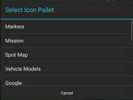Swipe in the iconset area or select the Iconset Name field, bringing up the iconset drop-down, to move between iconset pallets.

 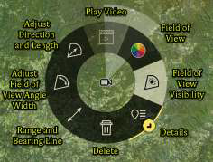The Mission iconset allows the user to place mission-specific markers. For instance, the Sensor marker can be placed with a visible Field of View (FOV) direction and length. The FOV can be adjusted from the Sensor radial.

## Vehicle models / rubbersheets

 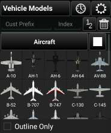The Vehicle Models iconset places to-scale 3D models of the selected icon. If the Edit option is selected, modifications to the model can be made in the same manner as the Rubber Sheet feature.

 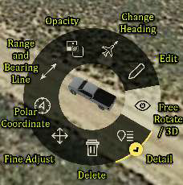See the Rubber Sheet section for more details. The Free Rotate / 3D View allows the user to quickly access the map rotation and 3D view of the Vehicle Model or other objects on the map.

## Advanced usage

 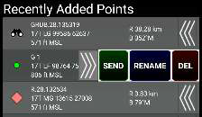The last point placed is shown at the bottom of the Point Dropper window. The information for all recently placed points can be accessed by selecting the Clock icon. This displays the marker icon, name, coordinates, elevation, and range & bearing information. The user can send, rename or remove any recently added markers by selecting the Arrows next to the marker to reveal SEND, RENAME or DEL buttons.

 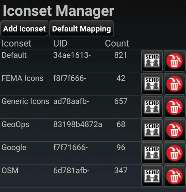Select the Iconset Manager (gear) button to add or delete iconsets or to set the default CoT Mapping.

 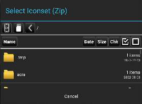 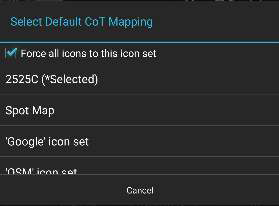
