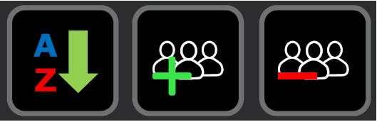
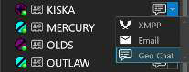
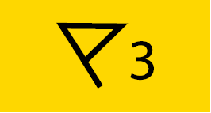
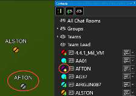
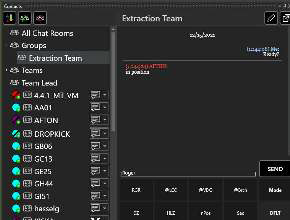
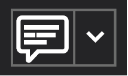
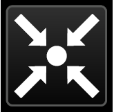
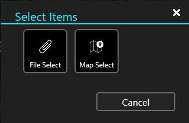
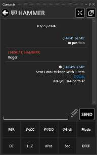

# Short instructions

## Contacts

 

\

## GeoChat - Group Management

  

## GeoChat - Messaging

 

## Chat

 

# Full Contacts / GeoChat / Chat manual instructions

## Contacts / GeoChat - Group Management

 Text-based Geochat messages may be sent to active network users by using the Contacts Tool. Select the Contacts icon to reveal the contact list.

 Users currently on the same local network and TAK Server can be seen in the contact list. At the top of the Contacts window are options to sort (alphabetically or by user status), create chat groups and delete chat groups.

To create a chat group, click on the Add Group icon. This will open the group configuration screen. Enter a name for the group and select the checkboxes beside the contacts to be added to the group. All selections can be confirmed by clicking OK. If a parent group is being created, no contacts need to be added at this level.

 To add a nested group, right click the parent group and select New Group, enter a name for the subgroup and select the Edit icon to add contacts to it. Groups may be managed at any time using the Edit option to add or delete contacts within a group or sub-group. Right-click a group, or sub-group, and select Delete to remove the desired group from the contact list. Groups can also be deleted by selecting the Delete Group icon.

## Chat

 To send a chat message to a group, select the group name from the contact list. By default, the groups that always exist within the contacts list are: All Chat Rooms, Teams (by color), and Role (user assigned role). When the All Chat Rooms group is selected, messages can be sent/received from all users on the local network and TAK Server. If a GeoChat message is sent from the top level of Teams, it will be sent to all contacts, similar to All Chat Rooms. When the Team category is expanded and the team is selected, messages are only sent to the user's Team.

When a parent group is chosen, messages are sent to all members of the parent group, as well as all members of the sub-groups beneath it. When a sub-group is chosen, messages are sent only to members of the sub-group.

 There are additional options available when communicating with an individual, depending on how the sending and receiving devices have been configured. Selecting the drop-down beside the Chat icon will reveal these additional communication methods. Supported options are VoIP (SIP), GeoChat, XMPP (TAK Chat Plug-in) messaging or e-mail.

  When receiving messages, the Chat icon will display a counter for the number of unread messages that have been received. When the contact list is opened, the number of unread messages will be visible beside the individual or group that contains the messages. Select the Chat icon, or group, to open the window with the chat dialog. Chats can also be accessed by selecting the flag located near the upper right corner of WinTAK.

 When examining individuals within the contact list, a status icon associated with the user marker icon is displayed. If a user is online and active, a green status icon is displayed. If a user is no longer online, it will be indicated by changing the status associated with that user to yellow. The user marker associated with that contact will also display gray on the map. As more time  elapses, the marker will be removed from the map and the contact's status will change to red. Messages sent to a user while they are offline will not be received.

 While using the Contacts Tool, the width can be expanded by clicking and dragging the left side of the contact's window. In this expanded view, the contact list and the chat messages of the selected group or individual can be seen at the same time. This view makes it easier to create, edit and delete chat groups.

## Contacts additional features

 Chat messages can be sent to both individuals and groups. Chat messages can be sent to an individual by selecting the Communication icon beside their callsign. When sending a message to an individual, a delivered icon will appear above the message (indicated with a checkmark). When the recipient reads the message, the icon will fill in, indicating it has been seen.

 Selecting the Pan To icon to the right of the callsign, at the top of an individual chat window, will pan the map interface to that user's location.

  Selecting the Attachment icon, beside Send, allows for the selection of files or map items to be sent directly to an individual as a data package. A chat message will be logged that a data package was sent, and the hashtag of items it contains. Selecting Details shows the contents of the data package. Selecting the folder icon next to a file name displays the file (images), other file types can be imported or an external application opened to display the file.

 Pre-defined messages are located at the bottom of the chat area. These pre-defined messages can be used to quickly create a message to send. Select Mode to scroll through the six different menus of messages, including: Default (DFLT), Assault (ASLT), Reconnaissance (Recon), Low Visibility (Low Vis), Jump Master (JM) and User messages. These pre-defined messages present an easy way to transmit a brief message to other network members concerning position or message understanding. To change the text of any of the pre-defined messages, long press/right click on the button and modify the preview text and corresponding button text. The predefined buttons can be disabled for additional space in the Chat window. The setting to enable/disable the buttons is located at Settings > Tool Preferences > Chat Preferences > Show Chat Buttons.
