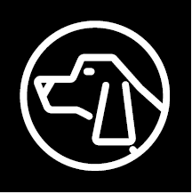

 The Bloodhound Tool provides support for tracking and intercepting a map item. It allows for the selection of two points on the map, and/or map objects, and displays Range & Bearing information between the chosen tracker and the target.

## TAK Product pages for Tool

* ATAK @[Bloodhound tool](../tak-products-for-users/atak-android-tak/tools-and-functions/bloodhound-tool)
