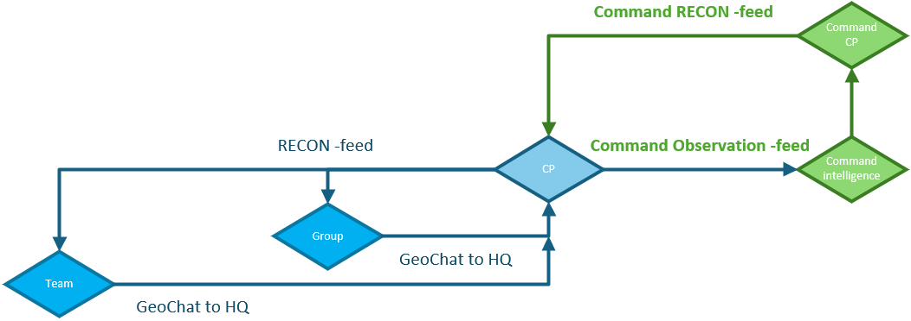
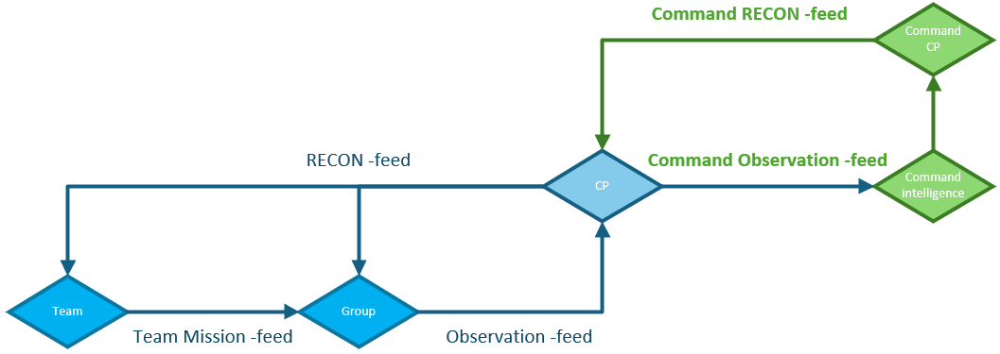

TAK is used to provide up to date intelligence to increase the situational awareness of troops. Having easy access to reviewed and verified information that can be easily updated.

Here are two basic use cases for forwarding, updating and sharing observations to the command and other users in the server. The ways are one-to-one share to HQ Role personnel and sharing with Observation feed. Admin will instruct the users witch way is used.

### HQ sharing diagram:

 

### Observation feed diagram:

 

## Sending via HQ Role

#### User - Sharing via HQ Role

User verifies data and creates a marker for it (filling the most critical information about it) and sends it to HQ role users.

Users use the one-to-one chat to give more information about the marker or highlight it if the information is urgent.

Sharing to the HQ brings the information available to only users with HQ role.

#### HQ - Sharing to whole server

HQ follows the information it is getting via messages / data packages

HQ verifies the received data (it is up to date and relevant) and sends it to the RECON feed to be distributed to the users. If relevant HQ can share the data to other servers.

Sharing to the RECON feed brings the information available to all users in the server.

## Sending via Observation feed

#### User - Sharing to Observation feed

User verifies data and creates a marker for it (filling the most critical information about it) and sends it to Observation feed. User can then update the information and keep it relevant when needed.

Users use the feed chat to give more information about the marker or highlight it if the information is urgent.

Sharing to the Observation feed brings the information available to users in the same group.

#### HQ - Sharing to whole server

HQ follows the servers Observation / Team feeds and looks for data that is needed in the RECON feed.

HQ verifies the received data (it is up to date and relevant) and sends it to the RECON feed to be distributed to the users. If relevant HQ can share the data to other servers.

Sharing to the RECON feed brings the information available to all users in the server.

#### User - Updates the RECON feed data to Observation feed

When user gets more information about a RECON feed data. They can update the information and share it via the Observation feed (Location of the marker, information about the marker, etc).

#### Observation feed specs

Only users that need to send information need the Observation feed and the only need to subscribe to it during the times they are taking part of the operation. Most users are only subscribing to RECON feed.

With bigger organizations there can be multiple Observation feeds or Mission feeds for different teams to have the instant access to new information. For the servers the main verified intelligence is the RECON feed.

## TAK Tools used:

* @[Contacts / GeoChat tool](../../tak-tools-for-products/contacts-geochat-tool)
* @[Data Sync -plugin](../../tak-tools-for-products/data-sync-plugin)
