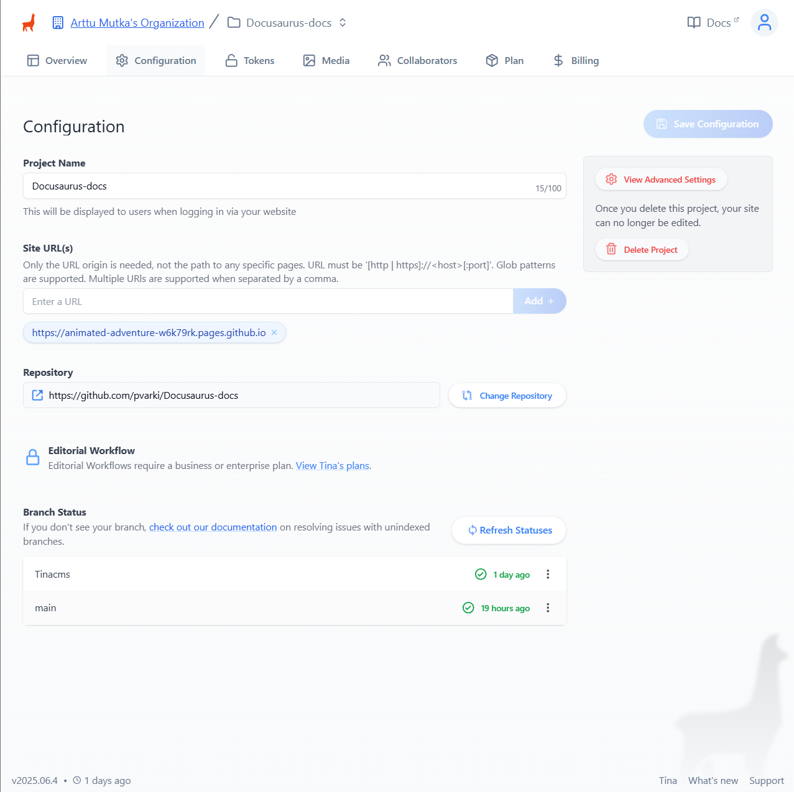
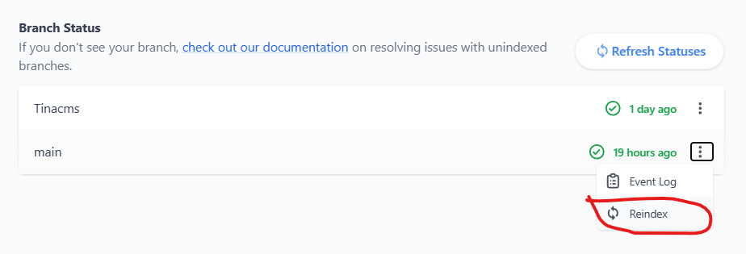

# TinaCMS Integration for Docusaurus

## Overview
TinaCMS is an open-source, headless content management system (CMS) designed to provide a user-friendly editing experience for static sites. This directory contains the configuration and setup for integrating TinaCMS with a Docusaurus documentation site.

## Purpose
The goal of this integration is to allow content editors to modify Docusaurus documentation directly through a web interface, accessible at `/admin` on your deployed site.

## Current Status ⚠️
**TinaCMS is currently not functional in this project.**
- The `/admin` route is not accessible. But going to localhost:4001/admin does show the TinaCMS admin interface. in development mode.
- The integration is incomplete and requires further setup and debugging.

## Intended Usage (When Working)
Once functional, TinaCMS should allow you to:
- Edit documentation pages in a visual editor.
- Save changes directly to your content repository.
- Manage content without needing to use Git or a code editor.

## Setup Instructions (Not Yet Functional)
1. Install dependencies:
   ```bash
   npm install
   # or
   yarn install
   ```
2. Configure TinaCMS by editing `tina/config.ts` and related files.
3. Start the Docusaurus development server:
   ```bash
   npm run dev
   ```
4. Attempt to access the admin UI at `http://localhost:3000/admin`.

> **Note:** These steps currently do not result in a working admin interface. See 'Current Status' above.

## Known Issues
- **Indexing problems:** If the build process complains about indexes, go to the Tina Cloud configuration, select the correct branch, and reindex as shown below:
  - 
  - 
- **Docker env variables:** Docker complains about the way env for tina is passed. Should be looked into, if it is safe way to pass env variables in dockerfile and if not change it.
   ```bash
      2 warnings found (use docker --debug to expand):
      - SecretsUsedInArgOrEnv: Do not use ARG or ENV instructions for sensitive data (ARG "TINA_TOKEN") (line 6)
      - SecretsUsedInArgOrEnv: Do not use ARG or ENV instructions for sensitive data (ENV "TINA_TOKEN") (line 10)
      dockerfile:38


## Unknown Issues
- The admin interface does not load correctly in production builds.
- npm error could not determine executable to run
  - Current issue i ran into is that the docs.yml build fails in build phase with the error:
    ```
    npm ERR! could not determine executable to run
    ```
  - This is maybe due to a misconfiguration in the `package.json` script. But in my limited testing, it didnt help to change the script.

## Resources
- [TinaCMS Documentation](https://tina.io/docs/)
- [GitHub Repository](https://github.com/pvarki/Docusaurus-docs)
- [Docusaurus Documentation](https://docusaurus.io/docs)
- [TinaCMS Deployment to gihtub pages](https://tina.io/docs/tina-cloud/deployment-options/github-pages)
- [TinaCMS with Docusaurus](https://tina.io/docs/guides/docusaurus)
- [TinaCMS in production with Tinacloud](https://tina.io/docs/tina-cloud/overview)
